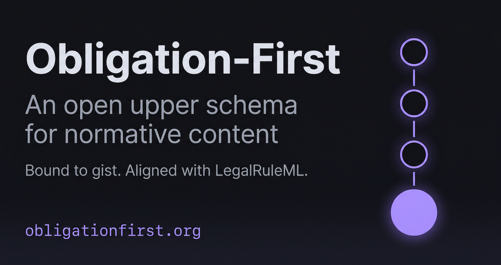

# Obligation-First



[](PROTOCOL.md)
[](LICENSE-CC-BY-4.0)
[](LICENSE-APACHE)
[](https://www.semanticarts.com/gist/)

A shared upper schema for normative content — laws, cases, and agreements — bound to the [Semantic Arts gist](https://www.semanticarts.com/gist/) upper ontology.

Obligation-First is a methodology and a JSON-LD context. The methodology says that normative content is best modeled by what it requires, not what it says. The schema gives that methodology a machine-readable shape.

**Live at [obligationfirst.org](https://obligationfirst.org/). Drafting in public. v0.1.0-draft. Subject to revision before the v0.1 freeze.**

## What this is

A small, opinionated upper schema with two parts:

1. **The four-role spine** — Authority, Instrument, Term, Obligation. Inherited from the Knowledge-as-Code pattern that PubLedge introduced. Bound to gist classes.
2. **The proceeding strand** — Proceeding, Allegation, Determination. New in Obligation-First. Models cases, enforcement actions, and rulings without forcing premature factual classification.

Together they cover three domains in one schema:

- **Statutes and regulations** — laws and the obligations they create (used by EveryAILaw)
- **Proceedings and enforcement** — cases, allegations, rulings (used by AI Incident Law)
- **Joint interpretations** — agreements between authorities and regulated parties (used by PubLedge)

## Why obligation-first

Most legal data models center on the document. Obligation-First centers on what the document *makes you do*. The advantages compound:

- **Cross-jurisdictional comparison becomes natural.** Two laws with the same Obligation are commensurable even when their texts differ.
- **Proceedings link cleanly to statutes.** A Determination anchors to the Obligation it interprets, not the textual provision.
- **Joint interpretations re-allocate Obligations between parties** — exactly what JIAs and RMAs do.
- **Rules-as-code engines plug in below the schema.** A Provision can carry an `executableEncoding` reference to a Catala scope, a Blawx ruleset, or an OpenFisca formula without changing the schema.

## Adopters

- [PubLedge](https://publedge.org/) — open recordkeeping protocol for joint interpretations (binding planned, additive)
- [EveryAILaw](https://everyailaw.com/) — AI law and obligation tracker (first-adopter binding planned)
- [AI Incident Law](https://aiincidentlaw.org/) — public-record corpus of AI-related cases (binding planned)

If you'd like to bind your project to v0.1, see [Quick start](#quick-start-bind-a-dataset-in-three-steps) below or [CONTRIBUTING.md](CONTRIBUTING.md).

## Quick start — bind a dataset in three steps

1. **Reference the canonical `@context`** — set `@context: "https://obligationfirst.org/v1/"` on every record. Repo-local extensions go in a second context object.
2. **Validate against the JSON Schemas** — run every record through the schema for its `@type` (eight schemas at `https://obligationfirst.org/v1/schema/`). Schema-conformant adopters (Level 2) pass validation for every published record.
3. **Cite [obligationfirst.org](https://obligationfirst.org/) as the canonical reference** — adopter sites and documentation should link back. The IRI prefix is permanent.

To validate your own records locally:

```bash
git clone https://github.com/snapsynapse/obligation-first.git
cd obligation-first
npm install
npm run validate    # runs scripts/validate-examples.mjs
```

The validator walks `examples/*/records/` and checks every JSON record against the appropriate schema. Adopters can drop their own records into a directory of the same shape and reuse the script.

## Machine-readable endpoints

Every artifact an adopter or agent needs is dereferenceable at a stable URL:

| Endpoint | Purpose |
|---|---|
| [`/v1/context.jsonld`](https://obligationfirst.org/v1/context.jsonld) | The JSON-LD `@context` for v1 |
| [`/v1/schema/*.schema.json`](https://obligationfirst.org/v1/schema/) | JSON Schemas — one per entity (eight total) |
| [`/llms.txt`](https://obligationfirst.org/llms.txt), [`/llms-full.txt`](https://obligationfirst.org/llms-full.txt) | LLM-readable summary + full context |
| [`/agents.json`](https://obligationfirst.org/agents.json) | Agent capabilities and endpoint inventory |
| [`/feed.xml`](https://obligationfirst.org/feed.xml) | Atom feed of releases |
| [`/sitemap.xml`](https://obligationfirst.org/sitemap.xml), [`/robots.txt`](https://obligationfirst.org/robots.txt) | SEO + AI-crawler allow-list |
| [`/.well-known/security.txt`](https://obligationfirst.org/.well-known/security.txt) | Security disclosure (RFC 9116) |
| [`/changelog.html`](https://obligationfirst.org/changelog.html) | Changelog (redirects to GitHub `CHANGELOG.md`) |

The IRI prefix `https://obligationfirst.org/v1/` is the resolution target. Once v0.1 freezes, `https://w3id.org/of/v1/` will be filed at w3id.org as the permanent canonical IRI.

## Repository layout

| Path | Purpose |
|---|---|
| [PROTOCOL.md](PROTOCOL.md) | The Obligation-First specification |
| [PRIOR-ART.md](PRIOR-ART.md) | Survey of legal ontologies, deontic logic foundations, and rules-as-code projects |
| [ROADMAP.md](ROADMAP.md) | Versioning plan, resolved-in-v0.1 table, deferred decisions |
| [CHANGELOG.md](CHANGELOG.md) | Material changes per version |
| `schema/context.jsonld` | The JSON-LD `@context` for v1 (canonical source — copied to `docs/v1/` by CI) |
| `schema/*.schema.json` | JSON Schemas for each entity |
| `scripts/validate-examples.mjs` | Validation harness: every JSON record under `examples/*/records/` is checked against the appropriate schema |
| `vendor/gist/` | Pinned snapshot of Semantic Arts gist (14.1.0) |
| `reference/crosswalks/` | Mappings to LegalRuleML, Akoma Ntoso, ELI/ECLI, gist |
| `reference/og-image-prompt.md` | Structured prompt for generating the OG social-card image |
| `examples/{air-canada,colorado-sb24-205,publedge-jia-utah-72}/` | Worked examples — three real record sets round-tripped through v0.1, with 23 canonical JSON record files under the `records/` subdirectories |
| `docs/` | Published website served by GitHub Pages from `main /docs` (canonical at obligationfirst.org) |
| `.github/workflows/` | CI: validation on every push (`test.yml`), Pages deploy (`pages.yml`), monthly a11y audit (`a11y.yml`) |
| `_workshop/` | Design conversation archives |

## What this is not

- Not a replacement for Akoma Ntoso, LegalRuleML, or ELI. Obligation-First references those standards; it does not duplicate them.
- Not a rules engine. The schema points at executable encodings (Catala, Blawx, OpenFisca) but does not implement them.
- Not legal advice. The schema is descriptive, not prescriptive.
- Not an attempt to model all of law. Scoped to the three domains above.

## Status

v0.1.0-draft. Spec, schemas, and worked examples are complete and live. Open items before v0.1 freeze:

- External review (Semantic Arts feedback on gist binding for Reparation; LegalRuleML community feedback on deontic alignment)
- First adopter binding (EveryAILaw — smallest lift, will validate the schema against living legal data)
- File w3id.org PR for the permanent IRI

The IRI prefix `https://obligationfirst.org/v1/` is the resolution target. `https://w3id.org/of/v1/` is planned as the permanent canonical IRI once v0.1 freezes.

## License

Spec text and reference material under [CC BY 4.0](LICENSE-CC-BY-4.0). Code (schemas, scripts, examples) under [Apache 2.0](LICENSE-APACHE).

Stewarded by PAICE.work PBC. Transition to an independent steward (PAICE Foundation) is anticipated.
